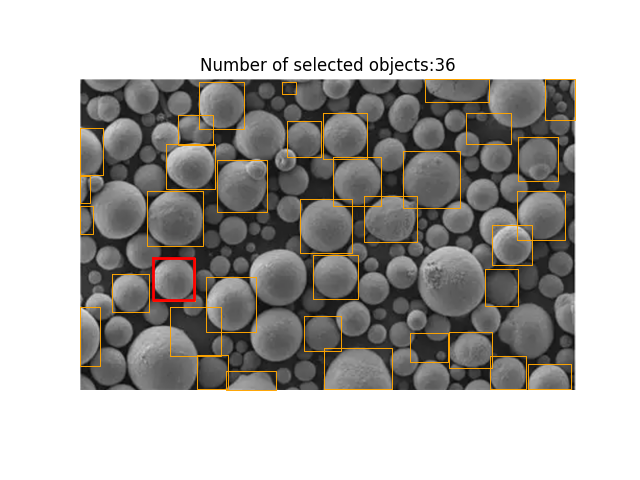
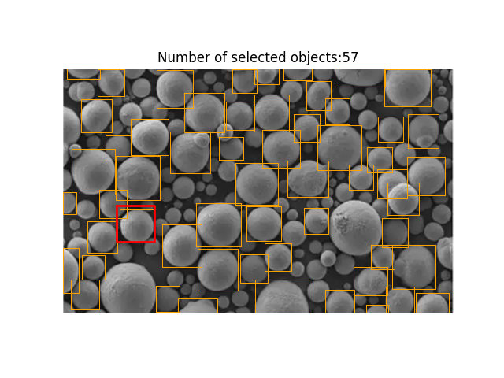
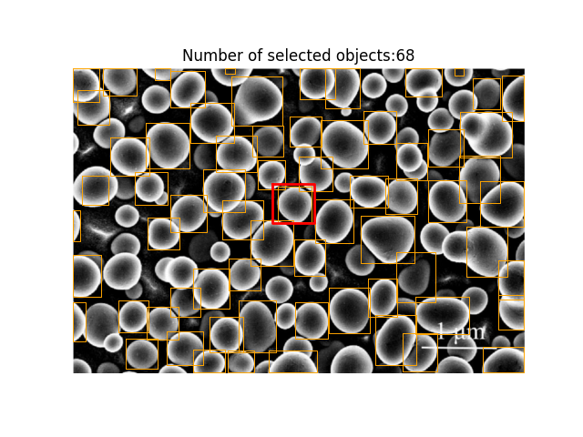
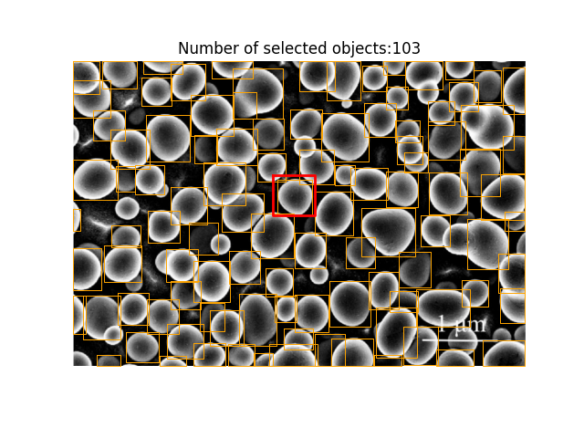

# Some-Changes-on-GeCo

GeCo（[原仓库](https://github.com/jerpelhan/GeCo)）是一个强大的少样本目标计数与检测模型。  
本仓库在 GeCo 基础上进行以下改动：

1. 新增**跨图搜索**能力  
2. 将 backbone 替换为 [EfficientViT-SAM](https://github.com/mit-han-lab/efficientvit)，性能提升  
3. 未完待续…

---

## 环境
- Python 3.10  
- CUDA 12.1  
- torch、torchvision、torchaudio  
- matplotlib  

---

## 权重准备
| 文件 | 放置路径 | 下载地址 |
|---|---|---|
| `GeCo.pth` | 仓库根目录 | [Google Drive](https://drive.google.com/file/d/1wjOF9MWkrVJVo5uG3gVqZEW9pwRq_aIk/view) |
| `sam_vit_h_4b8939.pth` | 仓库根目录 | [SAM 官方](https://dl.fbaipublicfiles.com/segment_anything/sam_vit_h_4b8939.pth) |
| `efficientvit_sam_l1.pt` | `Some-Changes-on-GeCo/third_party/efficientvit/assets/checkpoints/efficientvit_sam/` | [HuggingFace](https://huggingface.co/mit-han-lab/efficientvit-sam/resolve/main/efficientvit_sam_l1.pt) |

---

## 使用说明

### 跨图搜索
1. 确保已下载 `GeCo.pth` 与 `sam_vit_h_4b8939.pth`  
2. 运行根目录 `demo_cross.py`  
3. 在弹出窗口中选择**支持图** → 框选**示例框** → 关闭窗口 → 查看结果

### EfficientViT-SAM 改进
1. 确保已下载 `GeCo.pth` 与 `efficientvit_sam_l1.pt`  
2. 运行根目录 `efficientvitsam_demo.py`  
3. 选择图片 → 框选示例 → 关闭窗口 → 查看结果

<!-- 第一组 -->

  
&nbsp; &nbsp; &nbsp;
  

<em>图 1  左=eff_vit_sam，右=sam </em>

<!-- 第一组 -->

  
&nbsp; &nbsp; &nbsp;
  

<em>图 1  左=eff_vit_sam，右=sam </em>

